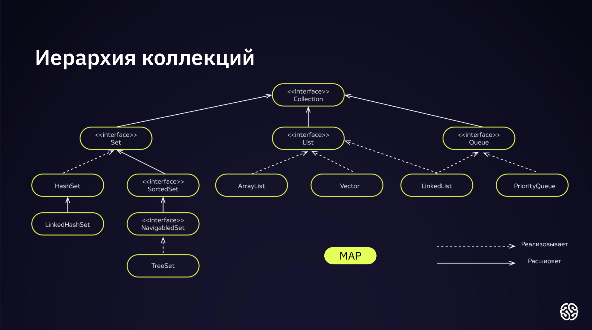
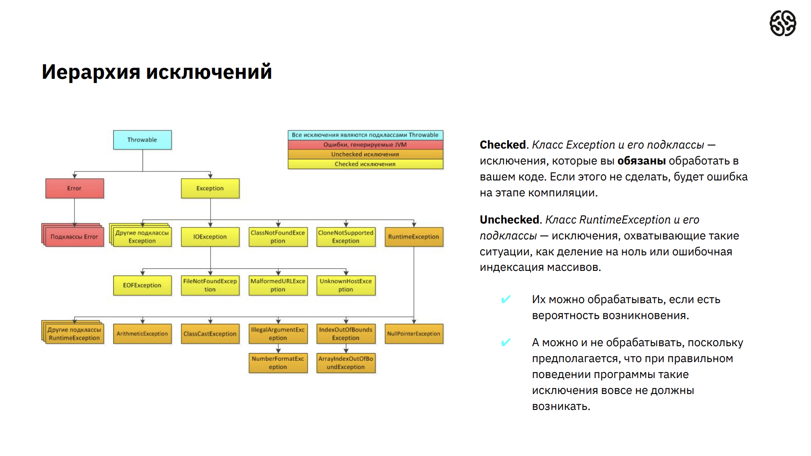

Топ 20 вопросов:
1) Что такое Java и почему она так широко используется в разработке программного обеспечения? - Java - это
высокоуровневый, объектно-ориентированный язык программирования. Она широко используется благодаря своей
платформенной независимости, простоте использования, богатой библиотеке и обширному сообществу разработчиков.

2) Каковы основные принципы объектно-ориентированного программирования (ООП)? - Основные принципы ООП включают
инкапсуляцию, наследование и полиморфизм.

3) Чем отличается интерфейс от абстрактного класса в Java? - Интерфейс предоставляет только сигнатуры методов без
их реализации, а абстрактный класс может содержать как абстрактные, так и конкретные методы. (Частично правда,
ибо в интерфейсе можно прописать дефолтное поведение). Также можно унаследовать множество интерфейсов, но класс
можно унаследовать лишь один.

4) Что такое JVM (Java Virtual Machine) и какую роль она играет в выполнении Java-приложений? - JVM - это
виртуальная машина, которая выполняет Java-байт-код. Она обеспечивает платформенную независимость, так как
Java-код компилируется в байт-код, который затем интерпретируется или компилируется JIT-компилятором в машинный
код.

5) Какие преимущества и недостатки управляемых и неуправляемых языков программирования? - Управляемые языки, такие
как Java, обеспечивают автоматическую управляемую среду выполнения, что делает их более безопасными. Неуправляемые
языки предоставляют больше контроля, но могут быть менее безопасными. Конкретика: управляемые языки предоставляют
среду выполнения, которая управляет жизненным циклом объектов, уборкой мусора, безопасностью типов и др. аспектами.

6) Что такое коллекции в Java? Какие основные типы коллекций вы знаете? - Коллекции в Java - это объекты,
предназначенные для хранения и манипулирования группами данных. Основные типы включают List, Set и Map.

7) Расскажите о потоках выполнения (threads) в Java. - Потоки выполнения - это легковесные процессы, которые
выполняются параллельно внутри программы. Они позволяют эффективно использовать многозадачность.

8) Какие ключевые слова используются для управления потоками в Java? - synchronized, wait, notify, notifyAll,
join, yield, sleep и др.

9) Что такое исключение (exception) в Java? Как обрабатываются исключения? - Исключение - это событие, которое
может возникнуть во время выполнения программы. Исключения обрабатываются с использованием блоков try, catch и
finally.

10) Чем отличается checked и unchecked исключение в Java? - Checked исключения должны быть явно обработаны
программистом, в то время как unchecked исключения могут быть не обработаны.

11) Как работает Garbage Collection в Java? - Garbage Collection автоматически удаляет объекты, которые больше
не доступны, освобождая память.

12) Что такое аннотации (annotations) в Java и для чего они используются? - Аннотации предоставляют метаданные о
коде и используются, например, для обеспечения дополнительной информации компилятору или фреймворку.

13) Как реализовать наследование в Java? - С помощью ключевого слова extends для классов и implements для
интерфейсов.

14) Что такое полиморфизм и как он реализуется в Java? - Полиморфизм позволяет объектам использовать методы с
одинаковыми именами, но разной реализацией. В Java это реализуется через перегрузку методов и интерфейсы.

15) Что такое JDBC (Java Database Connectivity) и для чего он используется? - JDBC - это API для взаимодействия с
базами данных из Java-приложений. Он предоставляет стандартный способ подключения и выполнения запросов к
базам данных.

16) Какие основные шаблоны проектирования (design patterns) вы знаете? - Например, Singleton, Factory, Observer,
Adapter, Builder, MTV, MVC.

17) Что такое SOLID принципы в объектно-ориентированном программировании? - SOLID - это набор принципов,
направленных на создание гибких, расширяемых и поддерживаемых кодов. Они включают Single Responsibility (принцип
единой ответственности), Open/Closed (принцип открытости/закрытости), Liskov Substitution (принцип подстановки
Барбары Лисков), Interface Segregation (принцип разделения интерфейсов), Dependency Inversion (принцип обратной
зависимости).

18) Как реализовать интерфейс в Java? - С использованием ключевого слова implements.

19) Какие основные типы данных примитивов существуют в Java? - Стандартные типы данных:
   
Названия типа и описание:
   
byte            для целочисленных чисел в диапазоне от -128 до 127, занимает 1 байт;
   
short           для целочисленных чисел в диапазоне от -32_768 до 32_767, занимает 2 байта;
   
int             для целочисленных чисел в диапазоне от -2_147_483_648 до 2_147_483_647, занимает 4 байта;
   
long            для целочисленных чисел в диапазоне от -9_223_372_036_854_775_808 до 9_223_372_036_854_775_807,
                   занимает 8 байт;
   
float           для вещественных чисел в диапазоне от -3,4 * 10^38 до 3,4 * 10^38, занимает 4 байта;
   
double          для вещественных чисел в диапазоне от +-4,9 * 10^-324 до +-1,8 * 10^308, занимает 8 байт;
   
char            для одиночного символа в кодировке UTF-16, занимает 2 байта (также можно записывать целые числа в
                   диапазоне от 0 до 65_535);
   
boolean         для булевых значений true и false (размер спецификацией языка строго не определён).

20) Как реализовать сортировку массива в Java? - С использованием метода sort из класса Arrays или метода
Collections.sort для коллекций.

Что было на собеседовании в ютубе:
- что такое ООП, его основные принципы - __Объектно-Ориентированное Программирование (ООП)__ — это методология
программирования, которая использует концепцию "объектов" для организации кода. Эти принципы обеспечивают более
гибкую, понятную и поддерживаемую структуру программы, делая код модульным и уменьшая его зависимость. ООП часто
используется для повышения читаемости, повторного использования кода и облегчения сопровождения программ.
Основные принципы ООП включают в себя:

__Инкапсуляция__:

Принцип: Идея заключается в том, чтобы объединить данные (переменные) и методы (функции), которые оперируют с
этими данными, в единый компонент — объект.

Пояснение: Можно представить объект как некоторую "капсулу", внутри которой хранятся данные и функции для работы с
этими данными. Такой подход способствует скрытию деталей реализации от внешнего кода.

__Наследование__:

Принцип: Позволяет создавать новые классы на основе существующих, наследуя их свойства и методы.

Пояснение: Если у вас есть класс "Автомобиль", вы можете создать новый класс "Грузовик", который наследует
свойства "Автомобиля", но при этом может содержать дополнительные характеристики, специфичные для грузовиков.

__Полиморфизм__:

Принцип: Позволяет объектам с одинаковой спецификацией использовать их общий интерфейс, но предоставлять
различную реализацию.

Пояснение: Если у вас есть метод "печать" в классе "Фигура", то у круга и квадрата он может быть реализован
по-разному, но в коде использоваться так же.

__Абстракция__:

Принцип: Отделение сущности от деталей реализации, позволяя сосредоточить внимание на важных аспектах.

Пояснение: Когда вы работаете с объектами, вы оперируете их общими характеристиками, не вдаваясь в технические
детали их внутренней реализации.

__Композиция__:

Принцип: Сочетание объектов более низкого уровня для построения объектов более высокого уровня.

Пояснение: Вы можете создать сложный объект, объединив несколько более простых объектов. Например, автомобиль
может содержать объекты двигателя, колес, и т.д.
- основные различия модификаторов доступа package-private и protected - __package-private (по умолчанию)__ область видимости 
ограничена пакетом, классы внутри того же пакета имеют полный доступ, а вне этого пакета - доступа нет. __protected__ область 
видимости ограничена пакетом и подклассами, подклассы могут получить доступ к защищённым членам.
- какие есть альтернативы наследованию (что такое ассоциация, композиция и агрегация) - __ассоциация__ определяет отношение 
между двумя классами, где один класс имеет ссылку на другой; __композиция__ - это более строгий вид ассоциации, где один 
объект владеет другим объектом. Если владеющий объект уничтожается, то и владеемый объект также уничтожается; __агрегация__ 
также представляет отношение между двумя классами, но в отличие от композиции, объекты могут существовать независимо друг 
от друга.
Примеры: _Ассоциация_ - класс "Клиент" и "Заказ" могут быть ассоциированы: каждый клиент может иметь несколько заказов. 
В классе "Клиент" может быть поле, содержащее ссылку на объект класса "Заказ". _Композиция_ - класс "Дом" может содержать 
объекты классов "Комната". Если "Дом" уничтожается, все его "Комнаты" также уничтожаются. _Агрегация_ - класс "Университет" 
может быть в агрегации с классами "Студент". Университет содержит студентов, но студенты могут существовать и вне университета.
- SOLID-принципы - представляют собой набор пяти основных принципов, которые спроектированы для создания гибкого, 
устойчивого к изменениям и легко поддерживаемого программного обеспечения. Применение этих принципов помогает создавать 
гибкий, расширяемый и легко поддерживаемый код, что особенно важно в контексте разработки масштабируемых и долгосрочных проектов.
Рассмотрим каждый принцип подробнее: 

__Принцип единственной ответственности (Single Responsibility Principle - SRP)__:
Определение: Каждый класс должен иметь только одну причину для изменения.

Пояснение: Этот принцип утверждает, что класс должен выполнять только одну задачу. Если у класса больше одной обязанности, 
изменения в одной из них могут повлиять на другую, что делает систему менее устойчивой и трудноразрабатываемой.

__Принцип открытости/закрытости (Open/Closed Principle - OCP)__:
Определение: Программные сущности (классы, модули, функции и т.д.) должны быть открыты для расширения, но закрыты для модификации.

Пояснение: Этот принцип подчеркивает необходимость создания гибкого кода, который может быть расширен без изменения его 
исходного кода. Это часто достигается через использование интерфейсов и абстракций.

__Принцип подстановки Барбары Лисков (Liskov Substitution Principle - LSP)__:
Определение: Объекты базового класса должны быть заменяемыми своими объектами производного класса без изменения корректности программы.

Пояснение: Если класс A является подклассом класса B, то объекты класса B могут быть заменены объектами класса A без влияния 
на правильность выполнения программы. Это поддерживает идею, что подклассы должны дополнять, а не изменять, поведение своих суперклассов.

__Принцип разделения интерфейса (Interface Segregation Principle - ISP)__:
Определение: Клиенты не должны зависеть от интерфейсов, которые они не используют.

Пояснение: Интерфейсы не должны быть избыточными, и клиенты не должны быть вынуждены реализовывать методы, которые им не 
нужны. Вместо этого, создавайте более мелкие интерфейсы, специфичные для клиентов.

__Принцип инверсии зависимостей (Dependency Inversion Principle - DIP)__:
Определение: Зависимости должны быть направлены от абстракций к деталям, а не от деталей к абстракциям.

Пояснение: Вместо того, чтобы классы высокого уровня зависели от классов низкого уровня напрямую, оба уровня должны зависеть 
от абстракций. Это облегчает замену компонентов без изменения кода на более высоких уровнях.

- назвать 3 шаблона проектирования, в чём их основная идея, привести пример использования - MTV, MVC, Singleton, Observer, Factory. 
Рассмотрим подробнее каждый:

__MTV__: Основная идея: Это шаблон проектирования, используемый во многих веб-фреймворках, таких как Django. Он разделяет логику приложения на три основных компонента: Model (Модель), Template (Шаблон) и View (Представление). 

Пример: В Django, Model представляет данные и бизнес-логику, Template отвечает за отображение данных пользователю, а View управляет взаимодействием между Model и Template.

__MVC__: Основная идея: Этот шаблон разделяет приложение на три компонента: Model (Модель), View (Представление) и Controller (Контроллер). Model управляет данными и бизнес-логикой, View отвечает за отображение данных пользователю, а Controller управляет потоком данных между Model и View. 

Пример: Веб-фреймворк Spring использует MVC для построения веб-приложений. Model представляет объекты данных, View определяет, как эти данные отображаются, а Controller обрабатывает запросы от пользователя и взаимодействует с Model и View.

__Singleton__: Основная идея: Гарантирует, что у класса есть только один экземпляр, и предоставляет глобальную точку доступа к этому экземпляру. 

Пример: Класс для работы с базой данных, где требуется единственное подключение. Пример на Java:
```java
public class Settings {
    private static Settings instance;
    private String param1;
    private int param2;
    private boolean param3;

    public static Settings getInstance() {
        if (instance == null) {
            instance = new Settings();
            instance.param1 = "A";
            instance.param2 = 2;
            instance.param3 = true;
        }
        return instance;
    }

    // Метод не позволит создать экземпляр класса.
    private Settings(){
    }
}
```
__Observer__: Основная идея: Определяет зависимость "один ко многим" между объектами таким образом, что при изменении состояния одного объекта все его зависимости оповещаются и обновляются автоматически. 

Пример: Реализация паттерна Observer в Java с использованием интерфейсов:
```java
interface Observer {
    void update(String message);
}

class Subject {
    private List<Observer> observers = new ArrayList<>();

    public void addObserver(Observer observer) {
        observers.add(observer);
    }

    public void removeObserver(Observer observer) {
        observers.remove(observer);
    }

    public void notifyObservers(String message) {
        for (Observer observer : observers) {
            observer.update(message);
        }
    }
}

class ConcreteObserver implements Observer {
    private String name;

    public ConcreteObserver(String name) {
        this.name = name;
    }

    @Override
    public void update(String message) {
        System.out.println(name + " received message: " + message);
    }
}
```
__Factory__: Основная идея: Предоставляет интерфейс для создания объектов в суперклассе, но позволяет подклассам изменять тип создаваемых объектов.

Пример: Фабричный метод в Python, создающий разные объекты в зависимости от условий:
```java
abstract class Employee {
    protected String name;
    protected String surName;
    protected double salary;

    public abstract double calculateSalary();

    public Employee(String name, String surName, double salary) {
        this.name = name;
        this.surName = surName;
        this.salary = salary;
    }
}

class Freelancer extends Employee{
    public Freelancer(String name, String surName, double salary) {
        super(name, surName, salary);
    }

    @Override
    public double calculateSalary() {
        return 20.8 * 8 * salary;
    }

    @Override
    public String toString() {
        return String.format("%s %s; Фрилансер; Среднемесячная заработная плата: %.2f (руб.); Почасовая ставка: %.2f (руб.)",
                surName, name, calculateSalary(), salary);
    }
}

class Worker extends Employee {
    public Worker(String name, String surName, double salary) {
        super(name, surName, salary);
    }

    @Override
    public double calculateSalary() {
        return salary;
    }

    @Override
    public String toString() {
        return String.format("%s %s; Рабочий; Среднемесячная заработная плата (фиксированная месячная оплата): %.2f (руб.)",
                surName, name, salary);
    }
}

enum EmployeeType {
    Worker,
    Freelancer
}

class Factory {
    static Random random = new Random();

    static Employee generateEmployee(EmployeeType employeeType){
        String[] names = new String[] { "Анатолий", "Глеб", "Клим", "Мартин", "Лазарь", "Владлен", "Клим", "Панкратий", "Рубен", "Герман" };
        String[] surnames = new String[] { "Григорьев", "Фокин", "Шестаков", "Хохлов", "Шубин", "Бирюков", "Копылов", "Горбунов", "Лыткин", "Соколов" };
        int salary = random.nextInt(200, 500);
        int index = random.nextInt(100, 150);
        return switch (employeeType){
            case Worker -> new Worker(names[random.nextInt(10)],
                    surnames[random.nextInt(10)],
                    salary * index);
            case Freelancer -> new Freelancer(names[random.nextInt(10)],
                    surnames[random.nextInt(10)], salary);
        };
    }

    static Employee generateEmployee(){
        int typeIndex = random.nextInt(2);
        return switch (typeIndex) {
            case 0 -> generateEmployee(EmployeeType.Freelancer);
            case 1 -> generateEmployee(EmployeeType.Worker);
            default -> null;
        };
    }

    static ArrayList<Employee> generateEmployees(int count){
        ArrayList<Employee> employees = new ArrayList<>();
        for (int i = 0; i < count; i++){
            employees.add(generateEmployee());
        }
        return employees;
    }

    public static void main(String[] args) {
        for (Employee e : generateEmployees(25)){
            System.out.println(e);
        }
    }
}
```
- что такое String Pool - String Pool — это пул, где JVM (Java Virtual Machine) хранит строковые литералы. Когда вы создаете 
строковый литерал в Java, JVM проверяет String Pool. Если строка уже существует в пуле, то вместо создания нового объекта 
строка используется повторно. Если же такой строки в пуле еще нет, то она добавляется.
- в чём разница между записью new String("abc") и просто без конструктора "abc" - разница: оператор new всегда
создаёт новый участок в случайном месте Heap, а при простом обозначении кавычек без оператора new - это явное
указание JVM: "Пожалуйста, иди не просто в Heap, а в специализированную область String Pool, т.е. по сути это
такой идентификатор.
- разница между StringBuilder и StringBuffer - зачем они нужны - преимущество использования в том, что под капотом
находится массив байтов, при методе append (например), он это складывает в массив после чего конвертирует в
строку, также главное преимущество в том, что мы не создаём промежуточных строк.
- в чём идея Autoboxing и Unboxing - Autoboxing и Unboxing - это процессы автоматического преобразования между примитивными типами данных и их соответствующими 
классами-оболочками (wrapper classes) в языке программирования Java. Эти механизмы были введены в Java для упрощения работы 
с примитивными типами в контексте использования объектов.

__Autoboxing__:
Идея: Автоматическое преобразование примитивного типа данных в объект соответствующего класса-оболочки (например, из int в Integer) при необходимости.

Пример:
```java
int primitiveInt = 42;
Integer wrapperInt = primitiveInt;  // Автоматическое преобразование Autoboxing
```
__Unboxing__:
Идея: Автоматическое преобразование объекта соответствующего класса-оболочки в примитивный тип данных при необходимости.

Пример:
```java
Integer wrapperInt = 42;
int primitiveInt = wrapperInt;  // Автоматическое преобразование Unboxing
```

- зачем нужны классы-обёртки - классы-обёртки примитивных типов в Java (например, Integer, Double, Boolean, и т.д.) созданы для того, чтобы предоставить 
объектную оболочку вокруг примитивных типов данных. Здесь несколько основных причин, по которым они могут быть полезны: 
1) Работа с коллекциями:
Коллекции (например, списки, множества, карты) в Java работают с объектами, а не с примитивными типами данных. Использование классов-обёрток позволяет включать примитивные типы в коллекции.
```java
List<Integer> numbers = new ArrayList<>();
numbers.add(42);  // Примитивное значение автоматически упаковывается в Integer благодаря Autoboxing
```
2) Null-значения:
Примитивные типы не могут быть равны null, так как они не являются объектами. Классы-обёртки могут принимать значение null, что полезно в определенных сценариях.
3) Использование в коллекциях библиотек и фреймворков:
Многие библиотеки и фреймворки в Java предоставляют методы, ожидающие объектные типы. Использование классов-обёрток позволяет использовать примитивные типы в таких контекстах.
4) Работа с generics:
Generics в Java работают с объектами. Если вы хотите создать обобщенный класс или метод, который работает с числовыми значениями, вы можете использовать классы-обёртки.
```java
public class Box<T> {
    private T value;

    public void setValue(T value) {
        this.value = value;
    }

    public T getValue() {
        return value;
    }
}

// Использование с Integer
Box<Integer> intBox = new Box<>();
intBox.setValue(42);
Integer intValue = intBox.getValue();
```
5) Методы и операции, предоставляемые классами-обёртками:
Классы-обёртки предоставляют полезные методы для работы с примитивными данными. Например, Integer предоставляет методы 
для преобразования строки в целочисленное значение (parseInt()), для выполнения операций сравнения и др.
```java
String numberStr = "123";
int parsedNumber = Integer.parseInt(numberStr);
```
- классы-обёртки изменяемы или неизменяемы -
В Java классы-обёртки (Integer, Double, Boolean, и так далее) являются неизменяемыми (immutable). Это означает, что объекты, 
созданные с использованием этих классов, не могут быть изменены после своего создания. Все операции, которые кажутся изменением значения, фактически создают новый объект.
```java
Integer x = 42;
x = x + 5;  // Новый объект Integer создается, но оригинальный объект не изменяется.
```
В этом примере значение x увеличивается на 5, но вместо изменения оригинального объекта Integer, создается новый объект, который затем присваивается переменной x. Это свойство неизменяемости имеет ряд важных последствий:

Безопасность потоков: Неизменяемые объекты безопасны в многопоточных сценариях, так как их состояние не может быть изменено после создания.

Кеширование значений: Поскольку объекты неизменяемы, их значения можно кешировать, что может повысить производительность в определенных случаях.

Предсказуемое поведение: Поскольку объекты неизменяемы, их значения гарантированно остаются неизменными во времени, что обеспечивает предсказуемость поведения программы.
- что нужно сделать, чтобы создать иммутабельный класс, о чём нужно побеспокоиться - объявить класс с ключевым словом final, чтобы предотвратить 
создание подклассов, которые могли бы изменить его поведение; сделать все поля класса private и final, чтобы предоствратить изменение их значений после создания 
объекта; не предоставлять методы для изменения состояния объекта; предоставить копии изменяемых объектов: если класс возвращает изменяемые объекты, нужно удостовериться, 
что возвращаемые объекты являются копиями или неизменяемыми, что предотвратит изменение состояния объекта через внешние ссылки; переопределить equals и hashCode, чтобы
обеспечить правильное сравнение если класс будет использоваться в многопоточной среде, следует удостовериться, что он безопасен в отношении потоков;
наш класс должен возвращать новый объект через геттер, а не тот объект, который мы реально храним, ибо стандартный геттер возвращает ссылку на объект.
- какие методы в классе Object ты знаешь: 
1) equals(Object obj):
Описание: Позволяет сравнивать объекты на равенство.
Пояснение: По умолчанию реализация этого метода в Object сравнивает объекты на их физическое равенство (то есть, ссылаются 
ли они на один и тот же объект в памяти). В некоторых случаях классы-потомки могут переопределять этот метод для сравнения по логическому равенству.

2) hashCode() :
Описание: Возвращает хеш-код объекта.
Пояснение: Хеш-код используется, например, при работе с хеш-таблицами. Реализации этого метода должны быть согласованы с методом equals().

3) toString() :
Описание: Возвращает строковое представление объекта.
Пояснение: По умолчанию возвращает строку, содержащую имя класса и хэш-код объекта. Метод toString() часто переопределяется в 
конкретных классах для предоставления информации о состоянии объекта.

4) getClass() :
Описание: Возвращает объект Class, представляющий класс объекта.
Пояснение: Метод предоставляет информацию о типе объекта во время выполнения.

5) clone() :
Описание: Создает и возвращает копию объекта.
Пояснение: Для правильной реализации этого метода класс должен реализовать интерфейс Cloneable. По умолчанию он выполняет 
поверхностное копирование, что может привести к проблемам с изменяемыми объектами.

6) finalize() :
Описание: Вызывается сборщиком мусора перед утилизацией объекта.
Пояснение: Этот метод редко используется из-за ненадежной природы вызова и неопределенного времени выполнения.

7) notify(), notifyAll(), wait() :
Описание: Методы для управления многозадачностью и синхронизацией потоков.
Пояснение: Эти методы используются в контексте многозадачности для сигнализации о событиях или ожидания изменения состояния объекта.

8) finalize() :
Описание: Вызывается сборщиком мусора перед утилизацией объекта.
Пояснение: Данный метод считается устаревшим и не рекомендуется к использованию. Лучше использовать блок try-with-resources для освобождения ресурсов.
- в чём заключается смысл контракта equals и hashCode (почему при переопределении equals нужно переопределить и
hashCode) - Контракт между методами equals() и hashCode() в Java заключается в том, что если два объекта равны согласно методу equals(), то их хеш-коды, 
возвращаемые методом hashCode(), должны быть равны. Это требование определено в спецификации Java, и его несоблюдение может привести к некорректному 
поведению объектов, использующих хеш-коды (например, при использовании в хеш-таблицах).

Вот почему важно соблюдать контракт между equals() и hashCode():
1) Корректное функционирование в коллекциях: Многие структуры данных, такие как HashMap или HashSet, используют хеш-коды для эффективного поиска и 
сравнения объектов. Если объекты, считающиеся равными по equals(), имеют разные хеш-коды, это может привести к некорректной работе таких структур данных.

2) Согласованность методов:
Если два объекта равны согласно equals(), то их хеш-коды должны быть равными. Это обеспечивает согласованное использование объектов в коллекциях, 
где объекты считаются равными, если их хеш-коды равны.

3) Эффективность поиска:
Предоставление хороших реализаций методов equals() и hashCode() позволяет структурам данных, таким как HashMap, равномерно распределять объекты 
по корзинам, что повышает эффективность поиска и вставки.

Вот пример, как можно переопределить equals() и hashCode() в Java:
```java
public class MyClass {
    private int intValue;
    private String stringValue;

    // конструктор, геттеры, сеттеры и другие методы

    @Override
    public boolean equals(Object obj) {
        if (this == obj) return true;
        if (obj == null || getClass() != obj.getClass()) return false;

        MyClass other = (MyClass) obj;

        return intValue == other.intValue && Objects.equals(stringValue, other.stringValue);
    }

    @Override
    public int hashCode() {
        return Objects.hash(intValue, stringValue);
    }
}
```
Здесь метод equals() сравнивает значения полей объектов, а метод hashCode() использует Objects.hash() для создания хеш-кода на основе значений 
полей. Важно отметить, что использование Objects.equals() и Objects.hash() обеспечивает корректное обращение с null и предотвращает некоторые 
типичные ошибки при реализации equals() и hashCode().

- какая основная причина появления такого контракта - Основная причина появления контракта между методами equals() и hashCode() заключается в 
- использовании объектов в коллекциях, таких как HashMap, HashSet и других структурах данных, основанных на хеш-таблицах.

Когда объекты добавляются в хеш-таблицу, структура данных использует хеш-код объекта для быстрого определения, в каком "ячейке" хранить этот объект. Затем, 
при поиске или удалении, структура данных сначала использует хеш-код для быстрого определения подмножества элементов, которые могут содержать соответствующий объект. 
Затем применяется метод equals(), чтобы точно определить, является ли найденный объект тем, который вы ищете.

Поэтому, чтобы структуры данных, такие как HashMap, корректно функционировали, необходимо, чтобы объекты, считающиеся равными согласно методу equals(), 
имели одинаковые хеш-коды. В противном случае, поиск объекта по хеш-коду может завершиться неудачей, и возможны непредсказуемые ситуации, такие 
как невозможность найти объект, который, на самом деле, уже присутствует в коллекции.

Соблюдение контракта между equals() и hashCode() обеспечивает, что объекты сравниваются согласованно: если объекты равны по equals(), то их 
хеш-коды тоже равны. Это важное условие для корректного функционирования хеш-таблиц и обеспечения эффективности поиска и вставки в таких коллекциях.

- иерархия коллекций - 

- назвать 2 наиболее часто используемых реализации List - ArrayList и LinkedList. Особенности:
    - ArrayList:
        - Особенности:
            - Реализован как динамический массив;
            - Обеспечивает доступ к элементам за константное время, так как использует индексы для доступа к элементам;
            - Медленные операции вставки и удаления в середине списка (O(n)) из-за необходимости сдвига элементов.
        - Когда использовать:
            - Когда требуется быстрый доступ к элементам по индексу;
            - Когда производится много операций чтения из списка, а операции вставки/удаления происходят реже.
    - LinkedList:
        - Особенности:
            - Реализован как двусвязный список;
            - Предоставляет более эффективные операции вставки и удаления в середине списка (O(1)), но более медленный доступ по индексу (O(n));
            - Требует больше памяти из-за дополнительных указателей.
        - Когда использовать:
            - Когда требуется часто выполнять операции вставки и удаления;
            - Когда доступ к элементам происходит не так часто.
- разница между обычным списком и связанным списком - в обычном массиве мы имеем адрес первого индекса, далее адрес второго (адрес первого + n-байт) и т.д. В связанном списке
за хранение элементов отвечает нода, соответственно, хранение идёт по ссылкам (нода ссылается либо на следующую, либо на предыдущую, либо на предыдущую и следующую, либо на null).
- засчёт чего можно получить быстрый доступ к первому и последнему элементу в связанном списке - засчёт точного "адреса" для головы и хвоста двусвязного списка. 
- скорость доступа к элементу в списке и связанном списке - если список двусвязный, первый и последний элемент O(1), если односвязный первый элемент O(1), в обоих оставшиеся элементы O(n).
- в каком типе коллекции быстрее удалить элемент - общие соображения:
    - LinkedList, HashSet, HashMap - O(1);
    - TreeMap, TreeSet - O(log(n));
    - ArrayList - O(n).
- разница между fail-fast и fail-safe:
    - Fail-Fast: __Определение__: Механизм, при котором программа немедленно завершает свою работу при обнаружении какой-либо ошибки или непредвиденной ситуации. 
__Использование__: Fail-fast используется, чтобы минимизировать потенциальные последствия ошибок и обеспечить более быструю диагностику и решение проблем. __Пример__: В коллекциях Java, 
если один поток изменяет коллекцию, в то время, как другой поток итерирует по этой коллекции, это может вызвать ConcurrentModificztionException, что является примером fail-fast поведения.
    - Fail-safe: __Определение__: Механизм, который продолжает выполнение программы, даже если произошла ошибка, и предоставляет возможность продолжить работу с минимальными нарушениями.
__Использование__: Fail-safe используется, чтобы предоставить более гибкое поведение программы в случае ошибки, позволяя продолжать выполнение, предоставлять альтернативные пути 
или изолировать ошибку. __Пример__: В контексте коллекций, fail-safe итераторы не выбрасывают ConcurrentModificationException в случае изменения другим потоком. Вместо этого они работают 
на копии коллекции или используют другие механизмы для предотвращения конфликтов.
- почему важно для HashMap переопределять hasCode и equals - является важной частью обеспечения корректного и эффективного функционирования этой структуры данных. Рассмотрим, почему это так:
    - Хэш-таблицы и равенство:
        - HashMap основана на хэш-таблице, где ключи хранятся в виде пар "ключ-значение". Хэш-таблица использует хэш-код ключа для быстрого описка значения;
        - для корректной работы хэш-таблицы объекты, которые равны согласно equals должны иметь одинаковые хэш-коды. Иначе поиск по ключу может возвращать неверные результаты.
    - Метод hashCode:
        - Метод hashCode возвращает целочисленное значение (хэш-код), которое используется хэш-таблицей для определение индекса, по которому будет храниться значение;
        - Если два объекта равны согласно equals, их хэш-коды должны быть равными. В противном случае объекты считаются разными, даже если equals возвращает true.
    - Метод equals:
        - Метод equals используется для точного сравнения ключей, если их хэш-коды совпадают;
        - Для корректного и равномерного распределения объектов по хэш-таблице equals должен быть реализован таким образом, чтобы равные объекты возвращали true, а разные - false.
    - Избегание коллизий:
        - Коллизии возникают, когда 2 различных ключа имеют одинаковый хэш-код. В случае коллизии HashMap использует метод equals для точного сравнения ключей;
        - Правильная реализация hashCode и equals помогает избежать коллизий и обеспечивает эффективное функционирование HashMap.
- hashCode нужен для ключа, значения или и того, и того - для ключа, ибо хэш-коллекции используют для хранения именно ключи.
- скорость доступа к элементу в HashMap - O(1). 
- иерархия исключений, основные аспекты при работе с ними - 

При работе с исключениями важно понимать исключения: структуру исключений, трейсбека исключений, использование try-catch, логирование исключений.
- почему нельзя поработать с Error:
    - Фатальность - ошибки Error представляют фатальные ситуации, которые обычно указывают на серьёзные проблемы в окружающей среде выполнения, такие как нехватка памяти или сбой
загрузки классов, восстановление таких проблем обычно невозможно или нежелательно;
    - Невозможность восстановления - в случае ошибок предполагается, что приложение не может восстановиться от этих ситуаций, попытки обработки или восстановления от Error могут привести 
к непредсказуемому поведению и даже более серьёзным сбоям;
    - Безопасность - обработка Error может скрыть факт серьёзной проблемы и привести к нестабильности приложения, также по соображениям безопасности, система должна быть в состоянии 
обнаружить фатальные ошибки и прекратить выполнение программы;
    - Непредсказуемость, некоторые ошибки типа Error невозможно предугадать, как следствие, можно лишь действовать на упреждение.
- в чём различия между проверяемыми и непроверяемыми исключениями - проверяемые исключения обязательно должны быть обработаны программистом, ибо такие исключения могут от него не зависеть 
(как пример, IOException), в то время как непроверяемые исключения можно не обрабатывать, ибо подразумевается, что хорошо написанная программа таких исключений не вызовет.
- что такое try-catch и зачем он нужен - конструкция в Java, которая позволяет программисту управлять ситуациями, когда в ходе выполнения программы происходит что-то неожиданное или
нежелательное. Использование этого блока позволит сделать программу отказоустойчивой.
- можно ли написать try без catch - можно, используя try-finally.
- что можно дополнить к try-catch - блок finally.
- в чём важность стейктрейса у исключений - стектрейс исключений даёт нам полную информацию про возникновение исключения: класс ошибки, места возникновения, описание ошибки.  
- что такое контекст ошибки - Термин "контекст ошибки" обычно относится к информации или условиям, которые сопровождают ошибку в программе и которые могут 
быть полезными при ее анализе или решении. Контекст ошибки обычно включает в себя информацию о том, где, когда и почему произошла ошибка. Контекст ошибки может ключать в себя: место в коде,
стек вызовов, значение переменных, сообщение об ошибке, контекст выполнения, логирование.
- что такое консистентность и атомарность в многопоточности:
    - Консистентность (Consistency) - в контексте многопоточности консистентность относится к тому, как программные данные представляют собой состояние, которое соответствует логическим 
ожиданиям программы. Если __программа является консистентной, это означает, что даже при использовании множества потоков общие данные поддерживают логические инварианты__. Пример: 
Рассмотрим банковский счёт. Если два потока одновременно изменяют баланс, консистентность предполагает, что после выполнения обоих изменений баланс на счёте будет соответствовать 
сумме этих изменений.
    - Атомарность (Atomicity) - Атомарность в многопоточности связана с тем, что операции выполняются как единый, неделимый блок. __Атомарные операции гарантируют, что они либо полностью 
выполняются, либо не выполняются совсем, и другие потоки не видят промежуточных состояний__. Пример: Операция увеличения счёта на определённую сумму должна быть атомарной. Если 2 потока 
пытаются увеличить баланс одновременно, атомарность гарантирует, что конечный результат будет корректным, а не возможным перекрытием или потерей данных. 
- что такое потокобезопасность - Потокобезопасность относится к свойству программы или объекта быть безопасным при использовании из нескольких потоков выполнения. В многозадачных и 
многопоточных программых, где несколько потоков могут одновременно образаться к общим данным или ресурсам, важно обеспечить корректное и безопасное выполнение кода. __Основные аспекты__:
    - Состояние объекта - объект считается потокобезопасным, если его состояние не подвержено гонкам данных при одновременном доступе из нескольких потоков. Гонка данных может привести к 
непредсказуемым результатам из-за одновременных операций чтения и записи;
    - Атомарные операции - Атомарные операции гарантируют, что они будут либо полностью выполнены, либо не выполнены вовсе, без промежуточных состояний, видимых другим потокам;
    - Блокировки и синхронизация - использование механизмов блокировки и других методов синхронизации для предотвращения гонок данных и обеспечения критических секций кода, которые должны
выполняться атомарно;
    - Поткообезопасные коллекции - использование коллекций, которые предоставляют потокобезопасные операции, такие как ConcurrentHashMap в Java;
    - Изоляций ресурсов - потокобезопасность также может быть связана с изоляцией ресурсов так, чтобы изменения в одном потоке не влияли на состояние ресурсов, к которым обращается 
другой поток.
- что такое дедлок - это ситуация в многозадачных или многопоточных программах, когда два или более процесса (или потока) находятся в состоянии ожидания друг друга для освобождения ресурсов, 
которые они держат. В результате ни один из процессов не может продолжить выполнение, и программа оказывается заблокированной. Основные характеристики Deadlock: 
    - взаимная блокировка - каждый процесс или поток владеет ресурсом, который нужен другому процессу для продолжения выполнения;
    - ожидание - процессы удерживают какой-то ресурс и ожидают освобождения других ресурсов, которые им нужны; 
    - непрерывность - ресурсы не могут быть изыманы у процесса принудительно, они могут быть освобождены только одним процессом;
    - циклическое ожидание - существует цикл ожидания, где каждый процесс ждёт освобождения ресурса, удерживаемого следующим в цикле.
Пример Deadlock в контексте многозадачности:
    - Процесс A удерживает ресурс X и ожидает ресурс Y;
    - Процесс B удерживает ресурс Y и ожидает ресурс X.
- что такое монитор, можно ли им управлять - монитор в контексте многозадачности относится к механизму синхронизации, предоставляемому языками программирования для координации доступа 
к общим ресурсам между потоками. В Java монитор является встроенным механизмом, который обеспечивает безопасность выполнения кода в многопоточной среде. Основные черты монитора:
    - Критические секции - монитор позволяет определить участки кода, которые могут быть выполнены только одним потоком одновременно, Эти участки обычно называются критическими
секциями;
    - Взаимное исключение - монитор обеспечивает взаимное исключение, что означает, что только один поток может находиться внутри критической секции монитора в любой момент времени;
    - Ожидание и уведомление - монитор предоставляет механизмы ожиданя и уведомления, который позволяет потокам согласованно взаимодействовать. Поток может войти в ожидание (wait) на
мониторе и быть уведомленным другим потоком о том, что какое-то условие было изменено;
    - Предоствращение Deadlock - мониторы помогают предотвратить deadlock, так как они обеспечивают строгий порядок захвата мониторов и освобождения их;
    - Синхронизация - мониторы обеспечивают синхронизацию потоков, чтобы избежать гонок данных и обеспечить надёжность работы в многопоточной среде.
- что такое захватить монитор; есть ли другие способы синхронизации, особенно говоря про коллекции - захватить монитор означает, что поток входит в критическую секцию кода, которая 
синхронизирована с использованием монитора, В Java для этого используется ключевое слово synchronized. Когда поток входит в блок кода, помеченный synchronized, он захватывает
монитор объекта, указанного после ключевого слова synchronized. Это предотвращает одновременный доступ других потоков к этому блоку кода. Кроме мониторов, существуют и другие 
механизмы синхронизации, особенно когда речь идёт о работе в многопоточной среде. Некоторый из них включают:
    - Коллекции из пакета java.util.concurrent - Java предоставляет специальные коллекции, предназначенные для безопасной работы в многопоточной среде, такие как 
ConcurrentHashMap, ConcurrentLinkedQueue и другие. Эти коллекции предлагают высокоуровневые операции, обеспечивающие атомарность и потокобезопасность.
    - Синхронизированные коллекции - Можно получить синхронизированную версию обычных коллекций с помощью метода Collections.synchronizedList, Collections.synchronizedMap и других.
Однако при использовании этих коллекций необходимо обратить внимание на возможные проблемы производительности и композиционные аспекты;
    - Locks - Java предоставляет интерфейс Lock и его реализации в пакете java.util.concurrent.locks. Locks предоставляют более гибкий и управляемый способ синхронизации по 
сравнению с традиционными мониторами.
    - Atomic Classes - классы из пакета java.util.concurrent.atomic предоставляют атомарные операции, которые могут быть использованы для обеспечения безопасного доступа к 
переменным в многопоточной среде.
- почему отказались от Vector в пользу ArrayList:
    - Производительность - поскольку ArrayList не синхронизирован, операции чтения и записи выполняются без накладных расхожов на синхронизацию. В случае Vector синхронизация может
привести к некоторому снижению производительности в многопоточных сценариях
    - Размер - Vector имеет некоторые дополнительные методы и функциональность, которая может быть избыточной, а ArrayList является более легковесным, предоставляя базовый интерфейс 
для работы с динамическими массивами.
    - Устаревший статус - Vector был введён в Java 1.0.
- что такое параметризированный тип и зачем он нужен -
  Параметризированный тип, также известный как обобщенный тип, представляет собой класс, интерфейс или метод, который объявлен с использованием параметра типа. 
Параметр типа позволяет создавать классы, методы или интерфейсы, которые могут работать с разными типами данных, обеспечивая при этом безопасность типов во время компиляции.
- что такое статический класс -  это класс, который содержит только статические члены (методы, поля, свойства). Статические члены принадлежат самому классу, а не его 
экземплярам, и поэтому они доступны без создания экземпляра класса. Этот тип класса нельзя инстанциировать (создать объект), и все его члены могут быть вызваны 
непосредственно через имя класса.
- какие признаки статического класса (он сам не вложен и вложенности у него нет) - все члены класса статические, нельзя создать экземпляр класса, не содержит вложенных классов.
- что по поводу конструктора у статического класса (что с ним нужно сделать) - сделать приватным. 
- как на уровне статического метода создать дженеричный тип, как создать статичный дженеричный метод - В Java, для создания статического метода с использованием 
обобщенного (дженеричного) типа, вы можете объявить статический метод с обобщенным параметром перед возвращаемым типом и списком параметров. Вот пример:
```java
public class GenericClass {
    // Статический метод с обобщенным типом
    public static <T> T genericMethod(T input) {
        System.out.println("Input: " + input);
        return input;
    }

    public static void main(String[] args) {
        // Использование статического метода с обобщенным типом
        int result1 = GenericClass.genericMethod(42);
        String result2 = GenericClass.genericMethod("Hello, Generics!");

        // В Java 10 и выше можно использовать тип var для вывода типа автоматически
        var result3 = GenericClass.genericMethod("Automatic Type Inference");

        // Использование статического метода с явным указанием типа
        Double result4 = GenericClass.<Double>genericMethod(3.14);

        // Вывод результатов
        System.out.println(result1);
        System.out.println(result2);
        System.out.println(result3);
        System.out.println(result4);
    }
}
```
В данном примере genericMethod - это статический метод, который принимает обобщенный параметр T и возвращает значение того же типа. Метод можно вызвать с различными типами данных.
- как унаследовать дженерик на уровне наследника от класса BaseIntite -
Для унаследования обобщенного типа на уровне наследника от базового класса с использованием дженериков в Java, вам нужно указать параметр типа на уровне наследования. Вот пример:
```java
// Обобщенный базовый класс
public class BaseEntity<T> {
    private T value;

    public T getValue() {
        return value;
    }

    public void setValue(T value) {
        this.value = value;
    }
}

// Наследник с уточненным параметром типа
public class DerivedEntity extends BaseEntity<String> {
    // Здесь параметр типа T установлен как String

    public void printValueLength() {
        String value = getValue();
        System.out.println("Length of value: " + value.length());
    }
}

// Использование
public class Main {
    public static void main(String[] args) {
        DerivedEntity derivedEntity = new DerivedEntity();
        derivedEntity.setValue("Hello, Generics!");

        // Метод printValueLength вызывает метод из базового класса с параметром типа String
        derivedEntity.printValueLength();
    }
}
```
В приведенном примере класс DerivedEntity унаследован от обобщенного класса BaseEntity, и при этом параметр типа T для BaseEntity уточнен 
как String при наследовании. Теперь DerivedEntity будет использовать String вместо обобщенного параметра.

Задача 1: у тебя есть интерфейс Manager. У него есть 2 метода "управлять" и "увольнять", т.е. кем-то он
управляет, а кого-то он увольняет. Этот интерфейс кем-то реализуется. В одном классе Manager1 реализует
только управление, а второй класс Manager2 реализует и управление, и увольнение. Как бы ты поступил: создал
1 громоздкий интерфейс или создал несколько интерфейсов.
Представим другую ситуацию: интерфейс состоит из 5 методов (неважно каких), это тот же Manager. И есть 2
подкласса, которые реализуют сразу все методы. Стоит ли в данном случае разделить на интерфейсы или оставить
монолитный интерфейс?

Ответ: В первом случае требуется разделить интерфейс на несколько интерфейсов. Во втором случае можно оставить как есть, если на разделение нет необходимости. Если же есть много 
времени и мало задач, то можно и разбить интерфейсы.

Задача 2: есть тип данных byte. Его переменная представлена в виде примитивного типа данных. Есть метод с
типом данных параметром, типа данных Short, но Short в то же время является классом-обёрткой. Мы знаем, что
byte уже, чем short. По логике, если мы передаём byte примитивный в качестве параметра, который выглядит как
Short объект. В теории всё должно быть хорошо, но как будет на самом деле - будет ли какая-то ошибка или
будет автоматическая конвертация?

Ответ: Выпадет ошибка, только если это не константа.

Задача 3: есть объект, у которого 2 метода. 1 метод синхронизированный, а 2 метод несинхронизированный.
Представим, что поток 1 уже захватил монитор и работает с синхронизированным методом этого объекта. И тут вдруг
поток 2 в это же время пытается поработать с этим же объектом, но с несинхронизированным методом. Запретит ли
монитор ему это выполнить, поставит в очередь или же 2 потока будут работать с разными методами одного и того же
объекта?

Ответ: В Java, если один поток уже захватил монитор объекта (выполняет синхронизированный метод), другие потоки, пытающиеся выполнить другие 
синхронизированные методы этого объекта, будут ожидать освобождения монитора.

Однако, если другой поток пытается выполнить несинхронизированный метод объекта в то время, когда монитор уже захвачен другим потоком, он не будет ожидать освобождения монитора. 
Вместо этого он сможет выполнить свой метод независимо от того, что другой поток уже выполняет синхронизированный метод.

Задача 4: есть класс, у которого есть при помощи diamond-синтаксиса определён какой-то тип данных (неважно какой).
Я хочу, чтобы у возвращаемых типов данных устанавливался этот параметр. Что мне нужно сделать с учётом того, что
я уже установил какой-то параметр на уровне всего класса. Т.е. я хочу, чтобы возвращаемый тип из метода get
возвращал тот тип данных, который я укажу в качестве параметра. Что для этого необходимо сделать? А можно ли то
же обобщение переиспользовать в статическом методе?

Ответ: Чтобы возвращаемый тип метода зависел от параметра, заданного на уровне класса, вы можете использовать обобщенный метод с параметром типа, который унаследован 
от параметра типа класса.